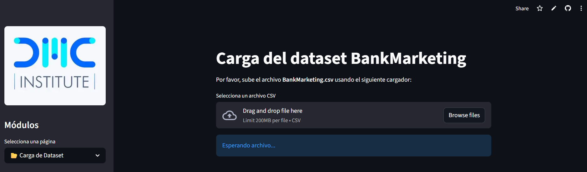
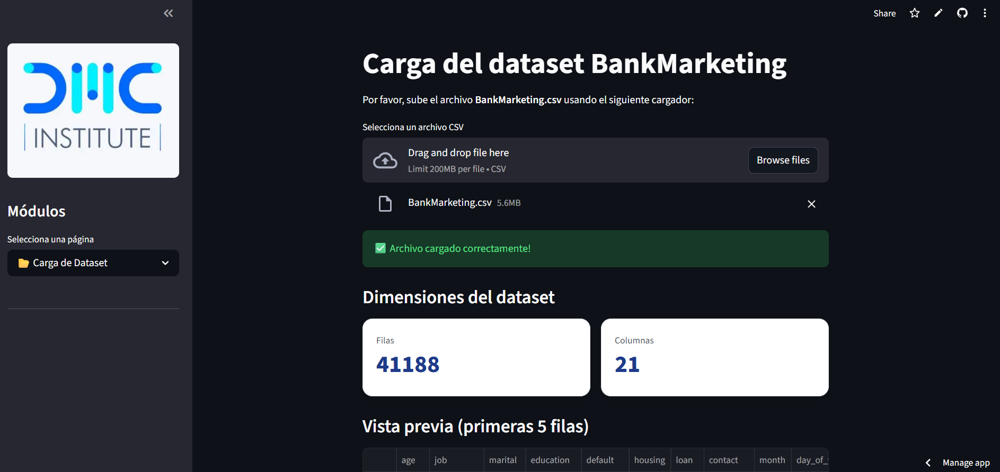
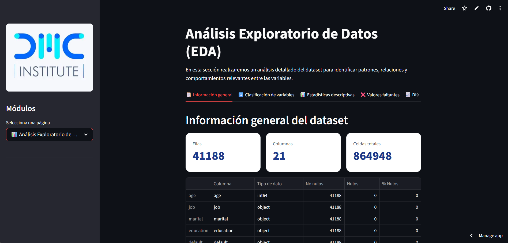

# 📊 BankMarketing EDA - Análisis Exploratorio de Datos

[](https://www.python.org/)
[](https://streamlit.io/)
[](https://pandas.pydata.org/)
[](https://matplotlib.org/)
[](https://seaborn.pydata.org/)
[](https://opensource.org/licenses/MIT)

## 📋 Descripción del proyecto

Aplicación interactiva desarrollada en **Streamlit** para realizar un Análisis Exploratorio de Datos (EDA) completo del dataset **BankMarketing**. El objetivo es identificar patrones, relaciones y comportamientos relevantes que expliquen la caída en la efectividad de las campañas de marketing de una institución financiera (de 12% a 8% en los últimos 6 meses).

Este proyecto fue desarrollado como parte de la **Especialización en Python for Analytics** y aplica conceptos fundamentales como:
- Programación Orientada a Objetos (POO)
- Manipulación de datos con Pandas y NumPy
- Visualización con Matplotlib y Seaborn
- Widgets interactivos de Streamlit

## 🚀 Aplicación en Streamlit

👉 **[Accede a la aplicación desplegada](https://caso-de-estudio-hpqkrxd4dz44tktewbzq6y.streamlit.app/)** 

## 📸 Capturas de pantalla

### Módulo Home


### Carga de datos (vista previa y dimensiones)



### Análisis Exploratorio (EDA)

*Vista del tab de distribución numérica*

## 🛠️ Tecnologías utilizadas

- **Lenguaje:** Python 3.9+
- **Librerías:** Pandas, NumPy, Matplotlib, Seaborn
- **Framework:** Streamlit
- **Programación Orientada a Objetos:** Clase `DataProcessor` que encapsula la lógica de análisis
- **Control de versiones:** Git y GitHub
- **Despliegue:** Streamlit Cloud

## 📁 Estructura del proyecto
```bash
BankMarketing-EDA/
│
├── app.py # Aplicación principal de Streamlit
├── data_processor.py # Clase DataProcessor (POO)
├── requirements.txt # Dependencias del proyecto
├── README.md # Documentación
├── .streamlit/
│ └── config.toml # Configuración de tema de Streamlit
├── capturas/ # Capturas de pantalla para el README
│ ├── home.png
│ ├── carga1.png
│ ├── carga2.png
│ └── eda.png
└── dataset/ # (Opcional) Carpeta con el dataset
└── BankMarketing.csv
```

## ⚙️ Instalación y ejecución local

Sigue estos pasos para ejecutar la aplicación en tu máquina local:

### 1️⃣ Clonar el repositorio
```bash
https://github.com/LuisAngel-web/Caso-de-Estudio/tree/main
```

### 2️⃣ Instalar dependencias
pip install -r requirements.txt

### 3️⃣ Ejecutar la aplicación
streamlit run app.py

### 📊 Funcionalidades principales
La aplicación está organizada en tres módulos navegables desde la barra lateral:

## 🏠 Módulo 1: Home
Presentación del proyecto y objetivos

Datos del autor

Descripción del dataset y tecnologías utilizadas

## 📂 Módulo 2: Carga de datos
Carga del archivo CSV (con separador punto y coma)

Validación y vista previa

Dimensiones del dataset

## 📈 Módulo 3: Análisis Exploratorio (EDA)
Organizado en 10 pestañas con análisis específicos:

Pestaña	Descripción
- 📋 Información general	Tipos de datos, valores nulos, dimensiones
- 🔢 Clasificación	Separación de variables numéricas y categóricas
- 📊 Estadísticas	Resumen estadístico (media, mediana, etc.)
- ❌ Valores faltantes	Conteo y visualización de nulos
- 📈 Distribución numérica	Histogramas interactivos con KDE
- 📊 Análisis categórico	Gráficos de barras y tablas de frecuencia
- 🔗 Bivariado (num-cat)	Boxplots, violines y histogramas por categoría
- 🔗 Bivariado (cat-cat)	Tablas de contingencia y barras agrupadas
- 🎛️ Análisis dinámico	Filtros combinados (edad, resultado) y gráficos a elección
- 📌 Hallazgos	Conclusiones clave del análisis
- 🧠 Programación Orientada a Objetos
Se implementó la clase DataProcessor (en data_processor.py) que encapsula:

- ✅ Clasificación de variables (numéricas/categóricas)
- ✅ Cálculo de estadísticas descriptivas
- ✅ Generación de visualizaciones (histogramas, boxplots, barras, scatter plots, contingencia)

Esto permite un código más limpio, reutilizable y fácil de mantener.

## 📈 Resultados y conclusiones
- Edad y aceptación: Los clientes entre 30-40 años presentan mayor tasa de aceptación.
- Duración de llamada: Llamadas >200 segundos tienen más éxito.
- Ocupación: Estudiantes y jubilados muestran alta aceptación relativa.
- Estacionalidad: Marzo, septiembre y octubre son los mejores meses.
- Variables económicas: Mayor tasa de empleo se correlaciona con mayor aceptación.

## 📝 Licencia
Este proyecto está bajo la licencia MIT. Ver el archivo LICENSE para más detalles.

## 👤 Autor
Luis Ángel Cordova Palomino
- 🎓 Especialización en Python for Analytics
- 📧 luisangelcordova52@gmail.com
- 🐙 GitHub https://github.com/LuisAngel-web/Caso-de-Estudio/tree/main
- - 📅 2026 – DMC Institute

⭐ ¡Gracias por visitar este proyecto!
Si te gustó, no olvides dejar una estrella en el repositorio. 😊
